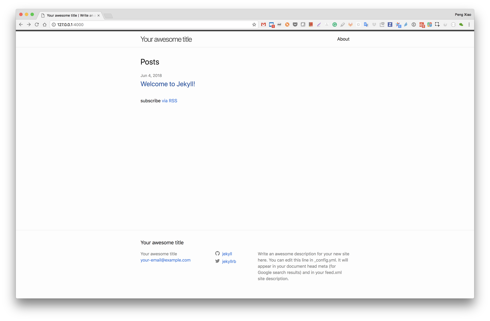

# jekyll-docker

[](https://quay.io/repository/omd/jekyll)


Play jekyll without install ruby and jekyll on your computer

```bash
docker pull quay.io/omd/jekyll
```

## Create a new site

Create a new site called `my-awesome-site` under local folder `/Users/penxiao/tmp`

```bash
docker run -it --rm -v /Users/penxiao/tmp:/omd quay.io/omd/jekyll jekyll new my-awesome-site
```

## Build and serve the site

```bash
docker run -it --rm -p 4000:4000 -v /Users/penxiao/tmp:/omd quay.io/omd/jekyll sh -c "cd my-awesome-site;bundle install;jekyll serve --host=0.0.0.0"
```

open the browser and go to [http://127.0.0.1:4000/](http://127.0.0.1:4000/) and we will see:




## Welcome to subcribe MY WeChat official account

欢迎大家订阅我的公众号，会不定期分享一些容器，网络，和编程相关技术文章。


